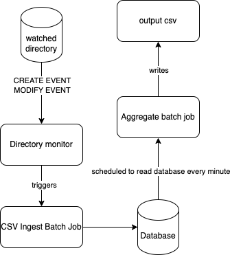

# dirmonitor
In a nutshell: watch a directory for file creation and modification events, parse the file and insert data to database, collect the database data to output file periodically.



When new file is created inside the configurable watched directory, or existing file is modified, [DirMonitor](src/main/java/com/firman/dirmon/ingest/DirMonitor.java) will receive notifications. The file contains list of connection information to domains. Sample input file is [sample-input.csv](src/main/resources/sample-input.csv). [DirMonitor](src/main/java/com/firman/dirmon/ingest/DirMonitor.java) will then triggers [DomainIngestConfig](src/main/java/com/firman/dirmon/ingest/DomainIngestConfig.java), which is Spring Batch job configuration class, to parse the newly added/modified input file and inserts the contained information to database.

The database defaults to in memory hsqldb. This can be replaced by modifying the database connection parameters in [application.properties](src/main/resources/application.properties). The schema can be found in [schema-all.sql](src/main/resources/schema-all.sql).

Once every minute, [DomainAggregateConfig](src/main/java/com/firman/dirmon/aggregate/DomainAggregateConfig.java), another Spring Batch job configuration class, will aggregate the data in database to collect the top 10 domains with the most connections. The result is written out to configurable output file that defaults to ```output.csv``` in current directory.

Properties of this app are configurable (check [application.properties](src/main/resources/application.properties) file). The watched directory defaults to ```inputfiles``` subdirectory of current directory. They can also be easily changed by passing them as command line arguments when running the resulting executable jar, for example as so: ```java -jar directory-monitor-0.0.1-SNAPSHOT.jar --batch.watchdir=/tmp```
